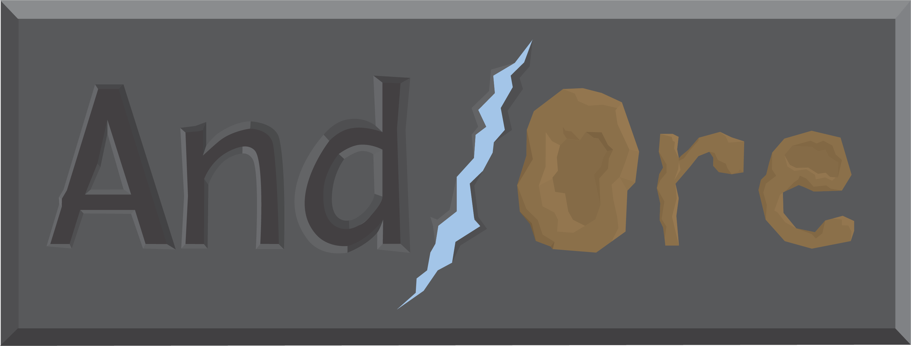

# And/Ore
A game about gathering ore, simple enough to take a reasonable amount of time to train a neural net, yet complex enough to be fun for a human player.

## Try the game out
* You can try the game out at http://iwanttorule.space
* You can also play the game by setting it up to run on your own server by following the instructions below.

You can find the wiki [here](wiki/)

##Setup

See [Setup For Developers](wiki/Setup_(Developers).md)

##Versions/Releases

Latest Release: [1.4 - Abrasive Armadillo](patchnotes/1.4_Abrasive_Armadillo.md)

Release in Development: [1.5 - Benevolent Bearded Dragon](patchnotes/1.5_Benevolent_Bearded_Dragon.md)

Patch Notes can be found [here](patchnotes/)

