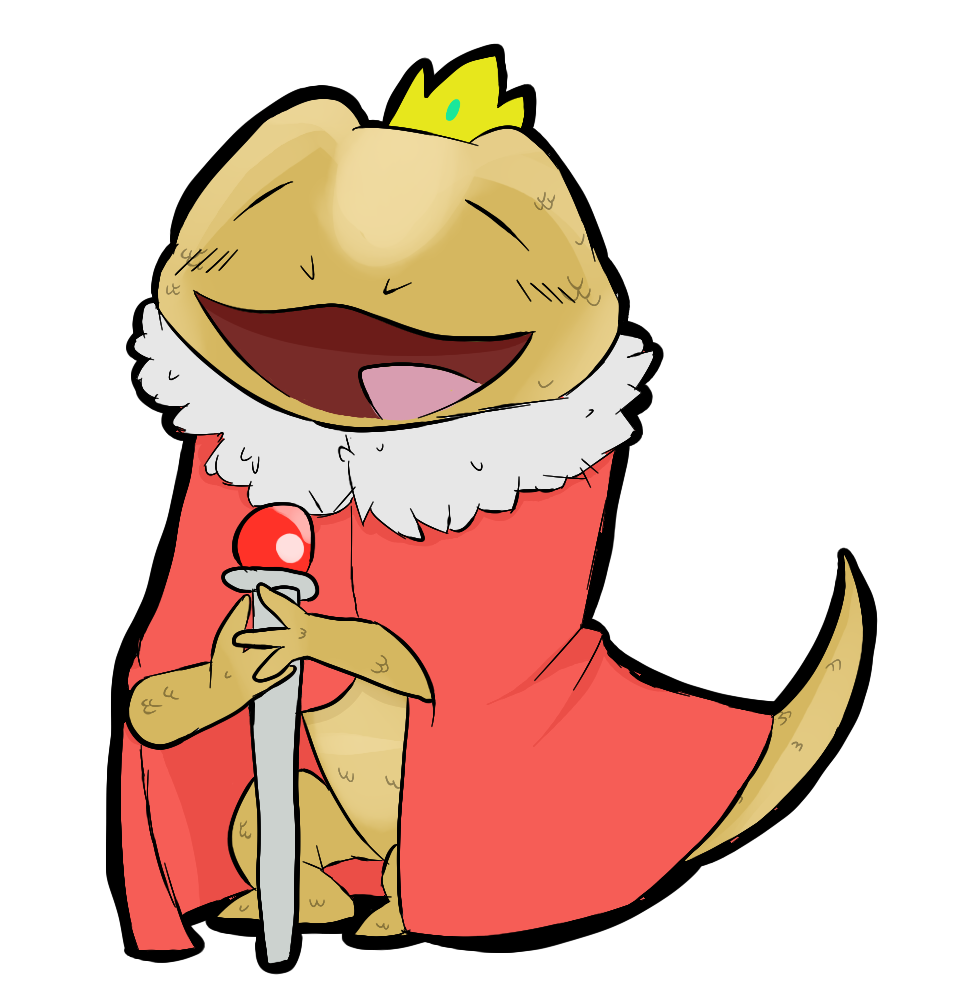

And/Ore v1.4.8.0
============

Benevolent Bearded Dragon [Alpha]
=====================

---

We optimized the rendering process for the game client by offloading the majority of the work to the client, removing a major bottleneck for the region servers.

---

We also added the ability to travel between regions with brand
new portals.

Each region has a portal that links to a specific region.
Below is a list of what regions link to what regions.

* Wojtek
    * Toivo
* Siwash
    * Toivo
* Scipio
    * Toivo
* Voytek
    * Toivo
* Toivo
    * Wojtek
    * Siwash
    * Scipio
    * Voytek

---

Sentry Turrets can no longer be constructed adjacent to another Sentry Turret, even diagonally.

---

Spiketraps can no longer be constructed.
